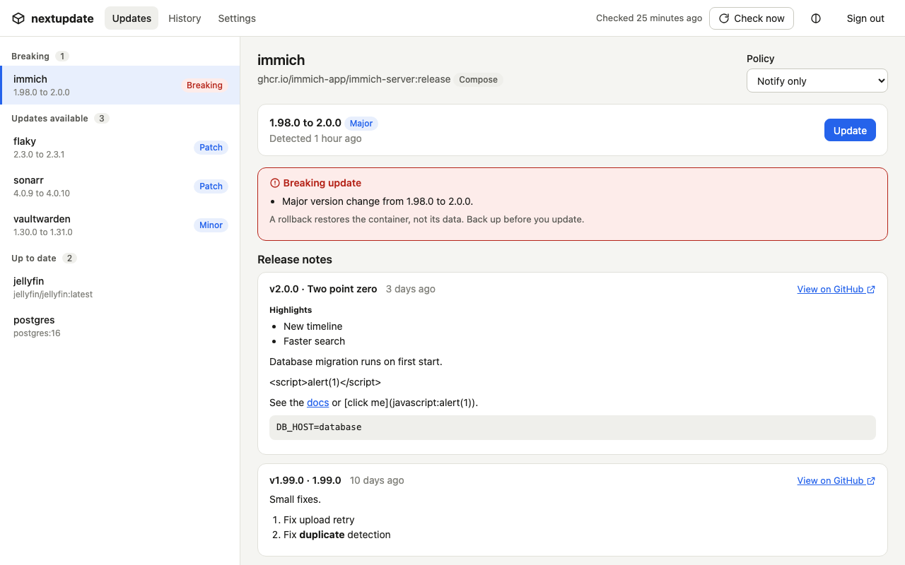
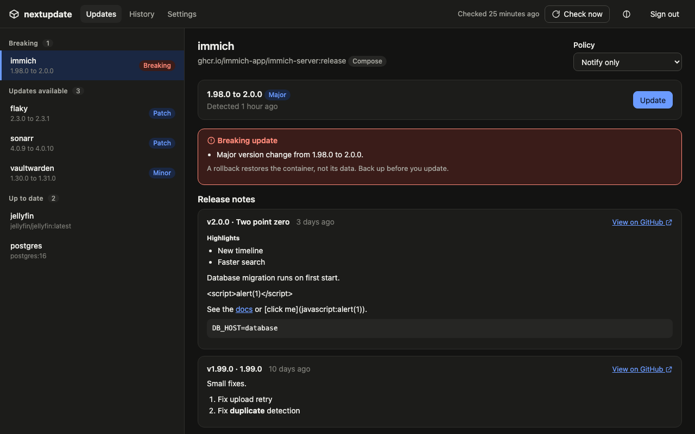
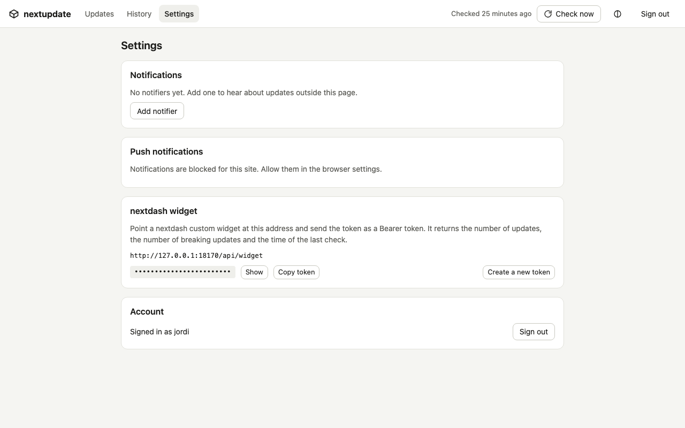
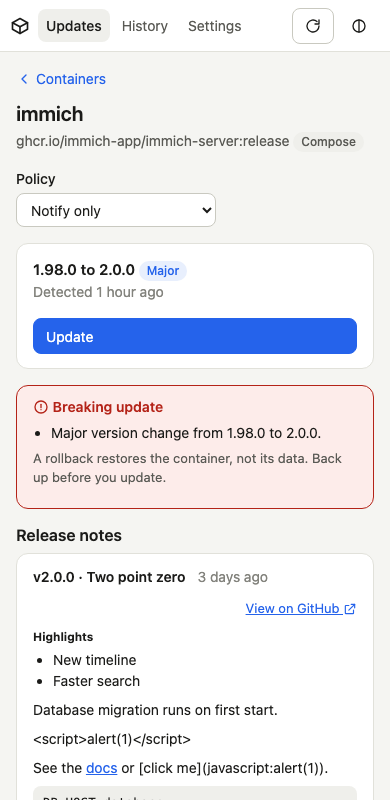

# nextupdate

**Update your Docker containers with your eyes open.** nextupdate shows what changes before you update, warns when an update looks breaking, updates with one click or by a rule you set per container, and rolls back by itself when the new container doesn't come up healthy.



*The screenshots show demo data.* It runs as one small container next to the others, works with Docker Compose services and plain `docker run` containers on one host, and comes with a web UI you can install as an app.

## What it does

- **Finds updates without pulling.** It compares the digest your container runs with the digest the registry serves, so `:latest` works too.
- **Shows what changes.** It reads the release notes on GitHub between your version and the new one, and marks an update as breaking when the version jumps a major number, when the notes mention things like a migration, or when a known-breaking version is listed.
- **Updates on your terms.** Per container: `notify` (tell me), `auto` (patch and minor updates only) or `never`. Breaking updates, major jumps, databases and unknown versions are never automatic.
- **Checks the result and undoes a bad update.** After an update it waits for the Docker health check (and an optional HTTP check) and puts the previous container back when it fails.
- **Tells you.** Push notifications on your phone or desktop, ntfy, Gotify, Discord, Telegram, a webhook or e-mail.
- **Fits your dashboard.** A small endpoint feeds a [nextdash](https://github.com/jordibrouwer/nextdash) widget.

<p>
  
  
</p>
<p>
  
</p>

## Run it

```yaml
services:
  nextupdate:
    image: ghcr.io/jordibrouwer/nextupdate:latest   # available from the first release on
    restart: unless-stopped
    ports:
      - "8099:8099"
    environment:
      NEXTUPDATE_BASE_URL: "http://your-server:8099"
      # NEXTUPDATE_GITHUB_TOKEN: "..."   # optional, raises the GitHub rate limit
    volumes:
      - /var/run/docker.sock:/var/run/docker.sock
      - ./data:/data
      # Compose projects: mount each project directory at the SAME path as on the host.
      - /srv/stacks:/srv/stacks
```

Until there is a release, build the image yourself. From a checkout, `make run` builds it and starts it on <http://localhost:8181> (data in `./data`); `make help` lists the other targets (`build`, `stop`, `restart`, `logs`, `test`). Change the port with `make run PORT=9000`. Or use `docker build -t nextupdate .` and `image: nextupdate` in the compose file above.

Open `http://your-server:8099`. The first visit creates the admin account.

Good to know:

- **Compose projects** must be mounted at the same path inside the container as on the host, because Compose records host paths on the containers it creates.
- **Private registries:** mount your Docker credentials, for example `~/.docker/config.json` at `/root/.docker/config.json`.
- **Version labels:** for `auto` updates and release notes, an image needs an `org.opencontainers.image.version` label that reads like `1.2.3`. Vaultwarden, Immich and nextupdate itself have one. Without one, or with a format nextupdate doesn't read yet (see Limits), the update still works by hand, and `auto` stays off for that container.
- **Release notes:** they come from the GitHub repository in the image's `org.opencontainers.image.source` label, from a small built-in list of well-known images, or from a repository you set per container.

## How it works

1. A check runs on a schedule (every 6 hours by default) and by hand.
2. For each container it compares the running digest with the registry's, reads the versions from the image labels and fetches the release notes in between.
3. The update is announced once, and applied only when the container's policy says so.
4. An update pulls the new image, replaces the container with the same settings, and waits for it to become healthy.
5. On failure the previous container comes back. A digest that failed is not retried automatically.

A rollback restores the **container, not its data**. When a new version migrates a database, the data stays migrated. Breaking updates show a warning for that reason and are never automatic, and the previous image is kept for a week (`NEXTUPDATE_KEEP_OLD_IMAGES`) so you can roll back by hand.

## Security

nextupdate can create and remove containers, so anyone who can sign in controls the Docker host. Put it behind HTTPS (a reverse proxy) and use a long password. Signing in is limited to five failed attempts per address in fifteen minutes, sessions last thirty days, and the API only accepts changes that carry a custom header, next to a strict same-site cookie.

The `/data` folder holds the database, including notifier secrets (ntfy, Gotify and Telegram tokens, the SMTP password) in plain text. Protect it like the Docker socket.

Release notes come from GitHub and can contain anything, so the UI shows them as plain formatted text: no HTML, and only `http` and `https` links. The UI is served with a strict Content-Security-Policy.

Running behind a `docker-socket-proxy` is possible through `DOCKER_HOST`, but a narrow proxy has not been tested with Compose updates yet.

## Command line

| Command | What it does |
|---|---|
| `nextupdate serve` | checks on a schedule, applies policies, serves the UI and API on `:8099` |
| `nextupdate check` | lists containers with a newer image |
| `nextupdate update <name>` | updates one container, rolls back on failure |
| `nextupdate policy <name> <notify\|auto\|never>` | sets the update policy |
| `nextupdate reconcile` | repairs an update that a crash interrupted |

Policies: `notify` (default) tells you; `auto` updates patch and minor versions but never breaking updates, databases or unknown versions; `never` stays silent.

## Environment

| Variable | Default | Meaning |
|---|---|---|
| `DOCKER_HOST` | `unix:///var/run/docker.sock` | Docker endpoint |
| `NEXTUPDATE_DATA` | `/data` | data directory |
| `NEXTUPDATE_LISTEN` | `:8099` | HTTP listen address |
| `NEXTUPDATE_BASE_URL` | empty | public URL, used in notification links and the widget |
| `NEXTUPDATE_INTERVAL` | `6h` | time between checks |
| `NEXTUPDATE_VERIFY_WINDOW` | `60s` | how long a new container gets to become healthy |
| `NEXTUPDATE_KEEP_OLD_IMAGES` | `168h` | how long the previous image is kept for a rollback |
| `NEXTUPDATE_GITHUB_TOKEN` | empty | optional GitHub token |
| `NEXTUPDATE_PUSH_SUBJECT` | `mailto:nextupdate@localhost` | contact address sent to push services |

## The web UI

- **Updates:** containers grouped as breaking, updates available and up to date. Pick one to read the release notes, see why an update looks breaking, and update or roll back. Keys: `j` and `k` move, `u` updates, `c` checks now.
- **History:** every update and rollback, with its steps.
- **Settings:** notifiers, push on this device, the token for the nextdash widget, and your account.

Install it as an app from the browser menu. Push notifications need HTTPS (a reverse proxy) or `localhost`, and a browser that has a push service.

## nextdash widget

Get the token from the Settings page. Then point a nextdash custom widget at `http://your-server:8099/api/widget` with the header `Authorization: Bearer <token>`. It returns `{"updates": N, "breaking": M, "lastCheck": "...", "url": "..."}`.

## Limits

- One Docker host. Other hosts are not supported yet.
- nextupdate does not update itself; it refuses to update its own container and says why.
- Sources are Compose services and `docker run` containers. Unraid templates are not read yet.
- Versions with more than three numbers, such as linuxserver.io's `4.0.20.3014-ls325`, are not read yet. Those containers show an unknown version, so they stay on `notify` and get no release notes. Suffixes like `-ls123` on a three-number version count as pre-releases, so their notes can be missing too.
- A private repository without credentials looks the same as a local build, and is skipped without a message.
- A container's `auto` policy is ignored while its version is unknown.

## Development

```sh
go test ./...                                   # unit tests
go test -tags integration ./test/integration/   # needs Docker
node --test web-test/*.test.mjs                 # UI helpers
npm ci && npx playwright install chromium
PW_WORKERS=2 npx playwright test                # UI tests against a demo server
go run ./cmd/uidemo                             # the UI over fake Docker data, on 127.0.0.1:8099
```

The UI is plain HTML, CSS and ES modules under `internal/web/static`, embedded in the binary. There is no build step.

## Releases

Pushing a tag such as `v0.1.0` runs the tests, builds a multi-arch image (amd64 and arm64), pushes it to `ghcr.io/jordibrouwer/nextupdate` (and to Docker Hub when the `DOCKERHUB_USERNAME` variable and `DOCKERHUB_TOKEN` secret are set) and creates a GitHub release. The image carries OCI labels for its version and source, so nextupdate can show release notes for itself.

## License

[MIT](LICENSE)
